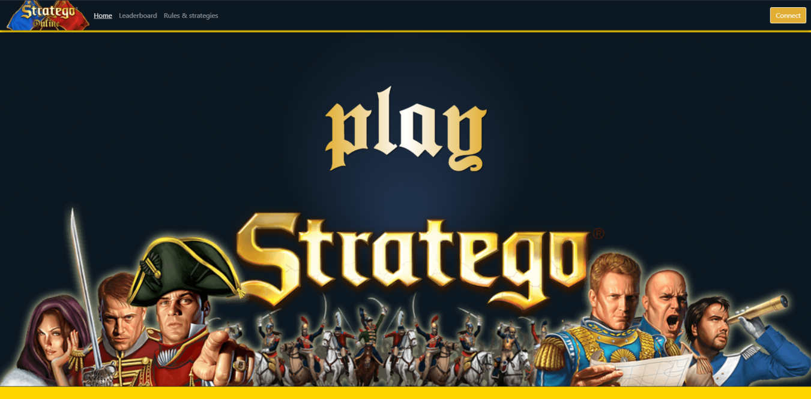

# StrategoOnline
A game project for our javascript class in Junia ISEN Lille (CIR2), it's a basic Stratego with working multiplayer.

Don't know how to play ? The rules are explained in the site!

**[Gameplay DEMO](https://www.youtube.com/watch?v=NJLrGxr3erw "Youtube Video")**

**[Presentation](StrategoPresentation.pdf "pdf")**

## Installing:
How should you redeploy the webserver ?

---

_Windows_

Download the .zip file and extract it.

Run `npm install` in the extracted folder, and `node index` to launch the node server

---

_Linux_
```bash
git clone https://github.com/HugoMartel/StrategoOnline
cd StrategoOnline
npm i
node index
```

---

To deploy the table, import [test.sql](test.sql) into a database called **StrategoOnline** under the **utf8mb4** format

## Dependencies
This project is made with those npm packages:
* [Babylon.js](https://github.com/BabylonJS/Babylon.js "Babylon's github") for the 3d part
* [Socket.io](https://github.com/socketio/socket.io "socket.io github") to connect the client 
* [Express](https://github.com/expressjs/express "Express github") for the server https
* [Mysql js](https://github.com/mysqljs/mysql "my sql js github page") to create account and database
* [Bootstrap](https://github.com/twbs/bootstrap "Bootstrap github") for css etc stuff
* [JsDoc](https://github.com/jsdoc/jsdoc "Jsodc github") to create the documentation of the project
* [jsSha256](https://github.com/emn178/js-sha256 "js Sha 256 github") to create secure password and for secured socketio connexion
* [Minami](https://github.com/nijikokun/minami "Minami Github"), template for JSDoc
* [Colors](https://github.com/Marak/colors.js "Colors Github"), used to add some colors inside of the server terminal
* [Notify](https://github.com/caroso1222/notyf "Notyf Github"), used to display notification toasts on the page
 
## Preview

